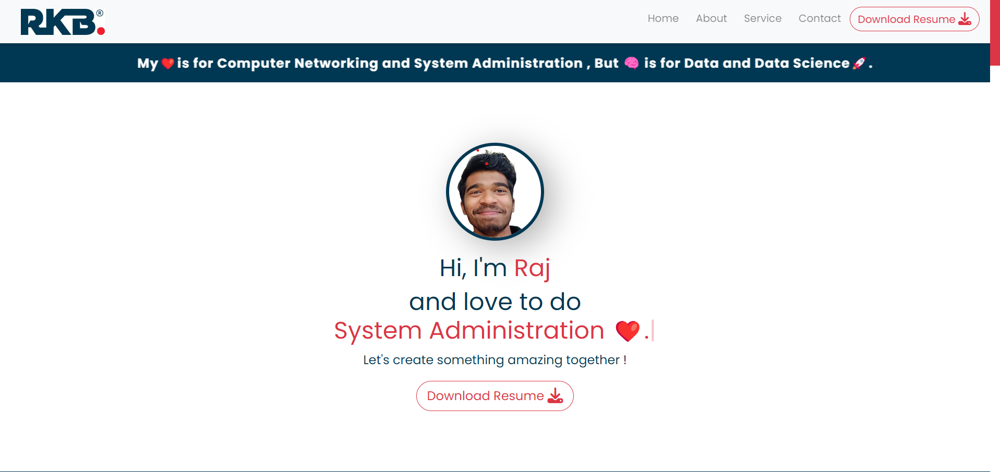

<h1 align="center">Portfolio_Website</h1>

<h3 align="center"> <a href="https://rajinfotechportfolio.000webhostapp.com/"> Visit My Portfolio Website 🔗↗️</a></h3>

<h3 align="center"> <a href="https://hub.docker.com/repository/docker/raj1406/my_portfolio_website/general">Download My Docker Portfolio Image🔗↗️ (Latest Version = v3.0) And Run.</a> </h3>

